# 📊 Complete Data Flow: Admin Creates Test → Student Runs Code → Judge0 Execution

## 🗄️ **1. Database Storage Format (MongoDB)**

### **Test Document Structure:**
```javascript
{
  _id: ObjectId("..."),
  title: "Python Programming Test",
  type: "coding",
  questions: [
    {
      _id: ObjectId("..."),
      kind: "coding",
      text: "Write a function to check if a number is even or odd",
      language: "python",  // Allowed: python, javascript, java, cpp, c, go
      visibleTestCases: [
        {
          _id: ObjectId("..."),
          input: "11",
          output: "Odd"
        },
        {
          _id: ObjectId("..."),
          input: "8", 
          output: "Even"
        }
      ],
      hiddenTestCases: [
        {
          _id: ObjectId("..."),
          input: "15",
          output: "Odd",
          marks: 2
        },
        {
          _id: ObjectId("..."),
          input: "0",
          output: "Even", 
          marks: 1
        }
      ],
      points: 10
    }
  ],
  createdBy: ObjectId("..."),
  createdAt: "2024-01-15T10:30:00Z"
}
```

### **Key Database Fields:**
- **`visibleTestCases`**: Student can see these when clicking "Run Code"
- **`hiddenTestCases`**: Used only for final submission grading
- **`language`**: Programming language (python, javascript, java, cpp, c, go)
- **`marks`**: Points assigned to each hidden test case

---

## 🔄 **2. Data Flow When Student Clicks "Run Code"**

### **Frontend Request:**
```javascript
POST /api/coding/run
{
  "assignmentId": "507f1f77bcf86cd799439011",
  "questionId": "507f1f77bcf86cd799439012", 
  "sourceCode": "n = int(input())\nif n % 2 == 0:\n    print('Even')\nelse:\n    print('Odd')",
  "language": "python"
}
```

### **Backend Processing:**
```javascript
// 1. Validate request
const { assignmentId, questionId, sourceCode, language } = req.body;

// 2. Fetch assignment and test from database
const assignment = await Assignment.findById(assignmentId).populate('testId');
const question = assignment.testId.questions.id(questionId);

// 3. Extract visible test cases
const visibleCases = question.visibleTestCases.map(c => ({ 
  input: c.input, 
  output: c.output 
}));

// 4. Call Judge0 service
const results = await runAgainstCases({ 
  sourceCode, 
  language: question.language || 'python', 
  cases: visibleCases 
});
```

### **Data Transformation to Judge0 Format:**
```javascript
// Each test case becomes a separate Judge0 submission
for (const testCase of visibleCases) {
  const submission = await createSubmission({
    sourceCode: "n = int(input())\nif n % 2 == 0:\n    print('Even')\nelse:\n    print('Odd')",
    language: "python",
    stdin: "11",           // testCase.input
    expectedOutput: "Odd"  // testCase.output
  });
}
```

---

## 🚀 **3. Judge0 API Request Format**

### **POST Request to Judge0:**
```javascript
POST https://judge0-api-b0cf.onrender.com/api/v1/submissions
Content-Type: application/json

{
  "source_code": "n = int(input())\nif n % 2 == 0:\n    print('Even')\nelse:\n    print('Odd')",
  "language_id": 71,        // Python3
  "stdin": "11",
  "expected_output": "Odd"
}
```

### **Language ID Mapping:**
```javascript
const languageMap = {
  python: 71,     // Python3
  javascript: 63, // Node.js
  java: 62,       // OpenJDK 13.0.1
  cpp: 54,        // GCC 9.2.0
  c: 50,          // GCC 9.2.0
  go: 60,         // Go 1.13.5
  ruby: 72        // Ruby 2.7.0
};
```

---

## 📥 **4. Judge0 Response Format**

### **Initial Submission Response:**
```javascript
{
  "id": "submission_12345",
  "status": "In Queue",
  "created_at": "2024-01-15T10:30:00Z"
}
```

### **Final Result Response (after polling):**
```javascript
{
  "id": "submission_12345",
  "status": "Accepted",           // or "Wrong Answer", "Runtime Error", etc.
  "stdout": "Odd\n",
  "stderr": "",
  "compile_output": "",
  "time": "0.001",
  "memory": 1024,
  "created_at": "2024-01-15T10:30:00Z",
  "finished_at": "2024-01-15T10:30:01Z"
}
```

### **Judge0 Status Codes:**
```javascript
const statusMap = {
  1: "In Queue",
  2: "Processing", 
  3: "Accepted",
  4: "Wrong Answer",
  5: "Time Limit Exceeded",
  6: "Compilation Error",
  11: "Runtime Error",
  13: "Internal Error"
};
```

---

## 🔄 **5. Backend Result Processing**

### **Result Transformation:**
```javascript
// For each test case result
const results = visibleCases.map((testCase, index) => {
  const submission = submissionResults[index];
  
  return {
    input: testCase.input,           // "11"
    expected: testCase.output,       // "Odd"
    stdout: submission.stdout,       // "Odd\n"
    stderr: submission.stderr,       // ""
    time: submission.time,           // "0.001"
    memory: submission.memory,       // 1024
    status: {
      id: 3,
      description: "Accepted"
    },
    passed: submission.status.id === 3,  // true
    marks: testCase.marks || 0
  };
});
```

### **Final Response to Frontend:**
```javascript
{
  "results": [
    {
      "input": "11",
      "expected": "Odd", 
      "stdout": "Odd\n",
      "stderr": "",
      "time": "0.001",
      "memory": 1024,
      "status": {
        "id": 3,
        "description": "Accepted"
      },
      "passed": true,
      "marks": 0
    },
    {
      "input": "8",
      "expected": "Even",
      "stdout": "Even\n", 
      "stderr": "",
      "time": "0.001",
      "memory": 1024,
      "status": {
        "id": 3,
        "description": "Accepted"
      },
      "passed": true,
      "marks": 0
    }
  ],
  "passed": 2,
  "total": 2
}
```

---

## 📤 **6. Data Flow When Student Clicks "Submit Code"**

### **Frontend Request:**
```javascript
POST /api/coding/submit
{
  "assignmentId": "507f1f77bcf86cd799439011",
  "questionId": "507f1f77bcf86cd799439012",
  "sourceCode": "n = int(input())\nif n % 2 == 0:\n    print('Even')\nelse:\n    print('Odd')",
  "language": "python"
}
```

### **Key Difference - Hidden Test Cases:**
```javascript
// Extract HIDDEN test cases (not visible to student)
const hiddenCases = question.hiddenTestCases.map(c => ({ 
  input: c.input, 
  output: c.output, 
  marks: c.marks  // Include marks for grading
}));

// Same Judge0 processing, but with hidden cases
const results = await runAgainstCases({ 
  sourceCode, 
  language: question.language || 'python', 
  cases: hiddenCases  // Hidden test cases
});
```

### **Grading Calculation:**
```javascript
const passedCount = results.filter(r => r.passed).length;
const totalMarks = hiddenCases.reduce((s, c) => s + (c.marks || 0), 0);
const earnedMarks = results.reduce((s, r) => s + (r.passed ? (r.marks || 0) : 0), 0);

// Final response includes grading
{
  "results": [...],
  "passedCount": 3,
  "totalHidden": 4,
  "earnedMarks": 8,
  "totalMarks": 10
}
```

---

## 🔍 **7. Complete Data Transformation Pipeline**

```mermaid
graph TD
    A[Admin Creates Test] --> B[Database: Test Document]
    B --> C[Student Clicks Run Code]
    C --> D[Frontend: POST /api/coding/run]
    D --> E[Backend: Extract visibleTestCases]
    E --> F[Transform: visibleTestCases → Judge0 format]
    F --> G[Judge0 API: POST /api/v1/submissions]
    G --> H[Judge0: Execute code]
    H --> I[Judge0: Return results]
    I --> J[Backend: Process results]
    J --> K[Frontend: Display results]
    
    L[Student Clicks Submit] --> M[Frontend: POST /api/coding/submit]
    M --> N[Backend: Extract hiddenTestCases]
    N --> O[Transform: hiddenTestCases → Judge0 format]
    O --> P[Judge0 API: POST /api/v1/submissions]
    P --> Q[Judge0: Execute code]
    Q --> R[Judge0: Return results]
    R --> S[Backend: Calculate grades]
    S --> T[Database: Save submission]
    T --> U[Frontend: Display final grade]
```



---

## 📋 **8. Summary of Data Formats**

### **Database Storage:**
- **Test**: Complete test with questions and test cases
- **Visible Test Cases**: `{ input, output }` - shown to students
- **Hidden Test Cases**: `{ input, output, marks }` - used for grading

### **API Requests:**
- **Run Code**: Uses `visibleTestCases` only
- **Submit Code**: Uses `hiddenTestCases` with marks

### **Judge0 Format:**
- **Input**: `{ source_code, language_id, stdin, expected_output }`
- **Output**: `{ status, stdout, stderr, time, memory }`

### **Frontend Response:**
- **Run Code**: `{ results, passed, total }` - immediate feedback
- **Submit Code**: `{ results, passedCount, earnedMarks, totalMarks }` - final grade

---

## 🎯 **Key Points:**

1. **Two Types of Test Cases**: Visible (for practice) and Hidden (for grading)
2. **Language Mapping**: Frontend language names → Judge0 language IDs
3. **Sequential Processing**: Each test case is sent as separate Judge0 submission
4. **Result Aggregation**: Backend combines all test case results
5. **Grading Logic**: Only hidden test cases contribute to final marks
6. **Real-time Feedback**: Run Code gives immediate results, Submit Code gives final grade
