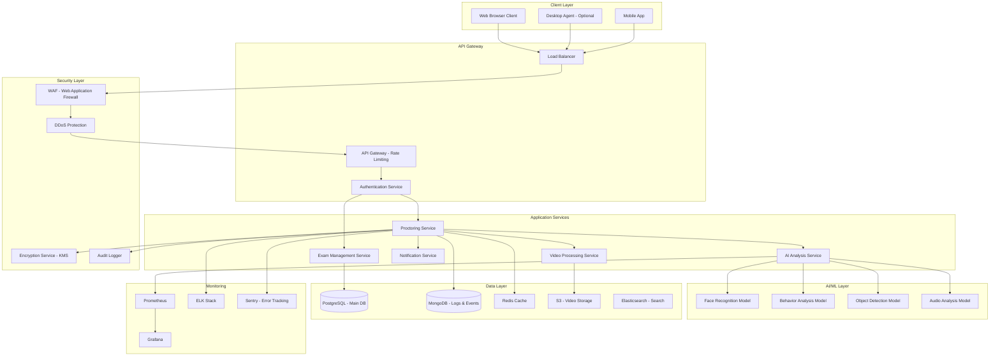
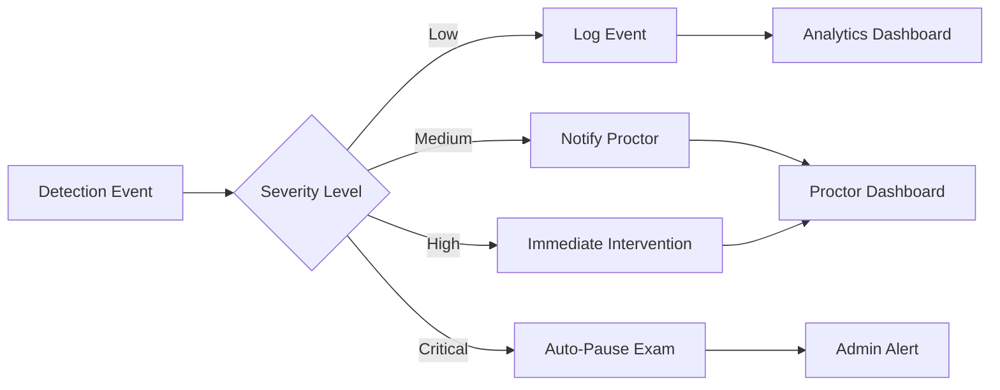
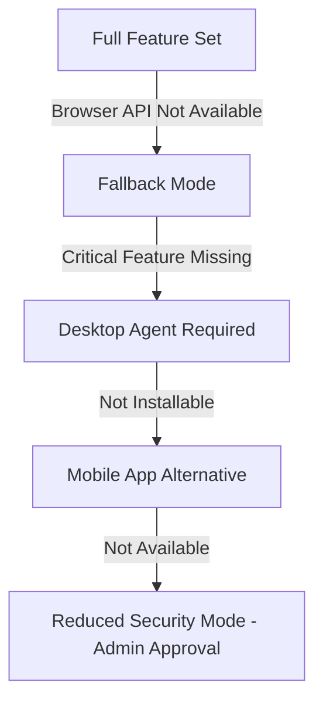

# 🎯 World-Class Proctoring System - Comprehensive Plan

## Executive Summary

This document outlines the architecture, features, and implementation strategy for building the most secure, reliable, and comprehensive proctoring system for online examinations. The system is designed to work flawlessly across all browsers, operating systems, and devices while maintaining the highest standards of security and user privacy.

---

## 🎨 System Vision

**Mission**: Create an unbreakable, fair, and privacy-respecting proctoring system that works universally across all platforms.

**Core Principles**:
- 🔒 **Security First**: Multiple layers of security with zero-trust architecture
- 🌍 **Universal Compatibility**: Works on Windows, macOS, Linux, iOS, Android, and all modern browsers
- ⚡ **Performance**: Lightweight and efficient, even on low-end devices
- 🛡️ **Privacy-Aware**: GDPR, CCPA, and international privacy law compliant
- 🎯 **Accuracy**: AI-powered detection with minimal false positives

---

## 📋 Table of Contents

1. [Core Features](#core-features)
2. [System Architecture](#system-architecture)
3. [Security Mechanisms](#security-mechanisms)
4. [Anti-Cheating Detection](#anti-cheating-detection)
5. [Cross-Platform Compatibility](#cross-platform-compatibility)
6. [Technical Stack](#technical-stack)
7. [Implementation Phases](#implementation-phases)
8. [Privacy & Compliance](#privacy--compliance)
9. [Performance Optimization](#performance-optimization)
10. [Monitoring & Analytics](#monitoring--analytics)

---

## 🚀 Core Features

### 1. Multi-Modal Monitoring

#### **Video Proctoring**
- **Face Detection & Recognition**
  - Real-time face tracking using MediaPipe/TensorFlow.js
  - Continuous identity verification throughout exam
  - Multiple face detection alerts
  - Head pose estimation (looking away detection)
  - Suspicious movement pattern recognition

- **Eye Gaze Tracking**
  - WebGazer.js integration for browser-based eye tracking
  - Alert on prolonged off-screen gazing
  - Screen region interest mapping

- **Recording Options**
  - Live streaming to secure servers
  - Local recording with post-exam upload
  - Selective recording (flagged moments only)
  - End-to-end encrypted video storage

#### **Audio Monitoring**
- Background noise detection
- Voice recognition (detecting multiple voices)
- Suspicious sound pattern alerts (whispers, phone rings)
- Audio spectrum analysis for electronic device detection

#### **Screen Monitoring**
- **Screen Recording**
  - Full screen capture using Screen Capture API
  - Multi-monitor detection and recording
  - Application window tracking
  - Clipboard monitoring

- **Browser Lockdown**
  - Prevent tab switching
  - Block right-click and keyboard shortcuts
  - Disable browser developer tools
  - Block copy-paste operations
  - Disable print screen functionality

- **Application Monitoring**
  - Detect forbidden applications running
  - Block virtual machines
  - Detect screen sharing software
  - Monitor system processes (desktop agent)

### 2. Advanced Anti-Cheating Mechanisms

#### **AI-Powered Behavior Analysis**
- Real-time behavior pattern recognition
- Abnormal mouse movement detection
- Typing pattern analysis (keystroke dynamics)
- Answer pattern analysis (timing, consistency)
- Suspicious answer similarity detection (collaboration detection)

#### **Network Monitoring**
- Network traffic analysis
- Detect unauthorized connections
- VPN/Proxy detection
- Unusual data transfer detection

#### **Environmental Analysis**
- Room scanning requirement (360° pan before exam)
- Continuous object detection (phones, books, people)
- Lighting analysis for screen reflection detection

#### **Biometric Verification**
- Fingerprint authentication (mobile devices)
- Face ID/Touch ID integration
- Continuous keystroke biometrics
- Mouse movement biometrics

### 3. Exam Security Features

#### **Question Security**
- Question scrambling (randomized order)
- Time-based question release
- Question pool randomization
- Encrypted question delivery
- Anti-screenshot watermarking (invisible student ID overlay)

#### **Browser Security**
- Secure browser mode (kiosk mode)
- Certificate pinning
- Response tampering detection
- Man-in-the-middle attack prevention
- SSL/TLS encryption enforcement

#### **System Integrity**
- Secure boot verification
- Anti-debugging techniques
- Code obfuscation
- Runtime application self-protection (RASP)
- Integrity checking (checksum validation)

---

## 🏗️ System Architecture

### High-Level Architecture



### Component Breakdown

#### **1. Client-Side Components**

**Web Browser Client** (Primary)
- Progressive Web App (PWA)
- WebRTC for video/audio streaming
- WebAssembly for performance-critical operations
- Service Workers for offline capability
- IndexedDB for local data storage

**Desktop Agent** (Optional - Enhanced Security)
- Electron-based native application
- System-level monitoring capabilities
- Process and application monitoring
- Screen recording with hardware acceleration
- Network traffic monitoring

**Mobile App** (iOS/Android)
- React Native or Flutter
- Native biometric integration
- Camera and microphone access
- Secure enclave utilization

#### **2. Backend Services**

**Proctoring Service**
- Real-time session management
- WebSocket connections for live monitoring
- Event streaming and processing
- Alert generation and routing
- Session recording coordination

**AI Analysis Service**
- Real-time video frame analysis
- Audio processing and analysis
- Behavior pattern recognition
- Anomaly detection
- Risk scoring engine

**Video Processing Service**
- Video stream ingestion
- Transcoding and optimization
- Thumbnail generation
- Video encryption
- Adaptive bitrate streaming

**Exam Management Service**
- Question bank management
- Exam scheduling and configuration
- Result processing
- Access control
- Reporting and analytics

**Notification Service**
- Real-time alerts to proctors
- Email notifications
- SMS alerts
- Push notifications
- Webhook integrations

#### **3. AI/ML Models**

**Face Recognition Model**
- Architecture: FaceNet, ArcFace, or DeepFace
- Deployment: TensorFlow Serving or ONNX Runtime
- Face detection: MTCNN or RetinaFace
- Liveness detection to prevent photo spoofing

**Behavior Analysis Model**
- LSTM/GRU for temporal behavior patterns
- Anomaly detection using Isolation Forest
- Attention mechanisms for suspicious activity

**Object Detection Model**
- YOLO v8 or EfficientDet for real-time detection
- Custom trained on exam-relevant objects
- Edge deployment for low latency

**Audio Analysis Model**
- CNN-based audio classification
- Speaker diarization
- Noise classification

---

## 🔐 Security Mechanisms

### 1. Authentication & Authorization

#### **Multi-Factor Authentication (MFA)**
```
User Login → Email/Password → OTP (SMS/Email) → Biometric (Optional) → Session Token
```

#### **Token Management**
- JWT with short expiration (15 minutes)
- Refresh tokens with rotation
- Token binding to device fingerprint
- Secure token storage (httpOnly cookies)

#### **Role-Based Access Control (RBAC)**
- Student: Take exams only
- Proctor: Monitor and review sessions
- Admin: Full system access
- Institution: Manage their exams
- Super Admin: Platform management

### 2. Data Protection

#### **Encryption at Rest**
- AES-256 encryption for all stored data
- Database-level encryption (TDE)
- File system encryption
- Encrypted backups

#### **Encryption in Transit**
- TLS 1.3 for all communications
- Certificate pinning for mobile apps
- Perfect forward secrecy
- HSTS enforcement

#### **End-to-End Encryption**
- Video streams encrypted before leaving client
- Zero-knowledge architecture for sensitive data
- Client-side encryption of recordings

### 3. Application Security

#### **Input Validation**
- Server-side validation for all inputs
- Parameterized queries (SQL injection prevention)
- XSS protection with CSP headers
- CSRF tokens for state-changing operations

#### **Rate Limiting**
- API rate limiting per user/IP
- Exponential backoff for failed attempts
- DDoS protection at CDN level

#### **Secure Session Management**
- Session binding to IP and user agent
- Automatic session timeout
- Concurrent session detection
- Session invalidation on suspicious activity

### 4. Infrastructure Security

#### **Network Security**
- VPC with private subnets
- Security groups and NACLs
- WAF rules for common attacks
- Intrusion Detection System (IDS)

#### **Container Security**
- Image vulnerability scanning
- Minimal base images
- Non-root container execution
- Secret management with Vault

#### **Monitoring & Logging**
- Centralized logging with ELK
- Real-time security alerts
- Audit trails for all actions
- Compliance reporting

---

## 🕵️ Anti-Cheating Detection

### Detection Matrix

| Cheating Method | Detection Mechanism | Confidence Level |
|----------------|---------------------|------------------|
| Tab Switching | Window focus events, Page Visibility API | 99% |
| Copy-Paste | Clipboard monitoring, keyboard event blocking | 98% |
| Screen Sharing | Process monitoring, screen count detection | 95% |
| Second Device | Environment scanning, network analysis | 85% |
| Another Person | Face recognition, gaze tracking | 92% |
| Virtual Machine | Hardware fingerprinting, VM detection | 90% |
| Unauthorized Apps | Process monitoring (desktop agent) | 95% |
| Phone Usage | Object detection, hand movement tracking | 80% |
| Pre-written Notes | Object detection, eye gaze analysis | 75% |
| Voice Communication | Audio analysis, voice detection | 85% |
| Collaboration | Answer pattern analysis, timing correlation | 88% |
| Impersonation | Face recognition, biometric verification | 96% |

### Real-Time Alert System



### Behavioral Scoring System

**Risk Score Calculation** (0-100)
- Base Score: 0 (No violations)
- Each violation adds points based on severity
- Temporal decay for minor violations
- Cumulative scoring for repeated violations

**Violation Weights**:
- Critical (30 points): Multiple faces detected, VM detected
- High (20 points): Tab switching, forbidden app detected
- Medium (10 points): Looking away frequently, noise detected
- Low (5 points): Mouse leaving exam area, unusual typing pattern

**Automated Actions**:
- Score 0-30: Normal monitoring
- Score 31-60: Enhanced monitoring, flag for review
- Score 61-80: Real-time proctor intervention
- Score 81-100: Auto-pause exam, require re-verification

---

## 🌐 Cross-Platform Compatibility

### Browser Support

| Browser | Desktop | Mobile | Minimum Version | Features |
|---------|---------|--------|----------------|----------|
| Chrome | ✅ | ✅ | 90+ | Full support |
| Firefox | ✅ | ✅ | 88+ | Full support |
| Safari | ✅ | ✅ | 14+ | Full support |
| Edge | ✅ | ✅ | 90+ | Full support |
| Opera | ✅ | ❌ | 76+ | Full support |
| Brave | ✅ | ✅ | 1.24+ | Full support |
| Samsung Internet | ❌ | ✅ | 14+ | Limited |

### Operating System Support

**Desktop**
- Windows 10/11 (x64, ARM64)
- macOS 10.15+ (Intel, Apple Silicon)
- Ubuntu 20.04+ / Debian 10+
- Fedora 34+ / CentOS 8+

**Mobile**
- iOS 14+ (iPhone, iPad)
- iPadOS 14+
- Android 9+ (API 28+)

### Feature Degradation Strategy



**Browser API Support Matrix**:
- WebRTC (Video/Audio): Required
- Screen Capture API: Preferred, fallback to desktop agent
- Page Visibility API: Required
- Clipboard API: Required
- MediaStream API: Required
- Fullscreen API: Preferred
- Web Crypto API: Required

### Responsive Design

- Desktop: Optimized for 1366x768 minimum
- Tablet: Optimized for 768x1024 (iPad)
- Mobile: Optimized for 375x667 minimum (iPhone SE)
- Accessibility: WCAG 2.1 AA compliant

---

## 💻 Technical Stack

### Frontend

**Core Framework**
- **Next.js 14** (React 18)
  - Server-side rendering
  - API routes
  - Middleware for security
  - Image optimization

**UI Library**
- **React** with TypeScript
- **Tailwind CSS** for styling
- **Framer Motion** for animations
- **Radix UI** for accessible components

**Real-Time Communication**
- **Socket.io Client** for WebSocket
- **WebRTC** for peer connection
- **Simple Peer** for WebRTC simplification

**AI/ML on Client**
- **TensorFlow.js** for in-browser ML
- **MediaPipe** for face detection
- **WebGazer.js** for eye tracking

**State Management**
- **Zustand** for global state
- **React Query** (TanStack Query) for server state
- **Jotai** for atomic state

**Video Processing**
- **MediaRecorder API** for recording
- **FFmpeg.wasm** for client-side processing

### Backend

**Runtime & Framework**
- **Node.js** 20 LTS
- **NestJS** (TypeScript framework)
  - Modular architecture
  - Dependency injection
  - Built-in validation
  - WebSocket gateway

**Alternative Microservices**
- **Python FastAPI** (AI/ML services)
- **Go** (High-performance services)

**Databases**
```
Primary: PostgreSQL 15 (User data, exam data)
Caching: Redis 7 (Sessions, rate limiting)
Logs: MongoDB 6 (Event logs, audit trails)
Search: Elasticsearch 8 (Full-text search)
Time-Series: TimescaleDB (Metrics, analytics)
```

**Message Queue**
- **Apache Kafka** (Event streaming)
- **RabbitMQ** (Task queuing)
- **Bull** (Job scheduling)

**Storage**
- **AWS S3** or **Google Cloud Storage** (Video storage)
- **CloudFront/CloudFlare CDN** (Content delivery)

### AI/ML Stack

**Python ML Services**
- **TensorFlow 2.x** / **PyTorch**
- **OpenCV** for computer vision
- **scikit-learn** for classical ML
- **Pandas & NumPy** for data processing

**Model Serving**
- **TensorFlow Serving**
- **TorchServe**
- **ONNX Runtime**

**Pre-trained Models**
- Face Recognition: **FaceNet**, **DeepFace**
- Object Detection: **YOLOv8**, **EfficientDet**
- Pose Estimation: **MediaPipe Pose**

### DevOps & Infrastructure

**Containerization**
- **Docker** for containerization
- **docker-compose** for local development
- **Kubernetes** (K8s) for orchestration

**CI/CD**
- **GitHub Actions** or **GitLab CI**
- **ArgoCD** for GitOps
- **Helm** for K8s package management

**Cloud Platforms**
- **AWS** (Primary)
  - EC2, ECS/EKS
  - RDS, ElastiCache
  - S3, CloudFront
  - Route 53, Certificate Manager
- **GCP** or **Azure** (Alternative)

**Monitoring & Observability**
- **Prometheus** (Metrics)
- **Grafana** (Dashboards)
- **Loki** (Logs)
- **Jaeger** (Distributed tracing)
- **Sentry** (Error tracking)
- **New Relic** or **Datadog** (APM)

**Security Tools**
- **HashiCorp Vault** (Secret management)
- **Snyk** (Vulnerability scanning)
- **SonarQube** (Code quality)
- **OWASP ZAP** (Security testing)

---

## 📅 Implementation Phases

### Phase 1: Foundation (Weeks 1-8)

#### **Week 1-2: Setup & Architecture**
- [x] Project setup (monorepo structure)
- [x] Development environment configuration
- [x] CI/CD pipeline setup
- [x] Database schema design
- [x] API contract definition (OpenAPI)
- [x] Architecture documentation

#### **Week 3-4: Core Infrastructure**
- [ ] Authentication & authorization system
- [ ] User management (CRUD)
- [ ] Database migrations
- [ ] API Gateway setup
- [ ] Redis caching implementation
- [ ] Basic frontend scaffolding

#### **Week 5-6: Exam Management**
- [ ] Question bank creation
- [ ] Exam creation and configuration
- [ ] Exam scheduling
- [ ] Student enrollment
- [ ] Basic exam taking interface
- [ ] Result processing

#### **Week 7-8: Testing & Refinement**
- [ ] Unit tests (80% coverage)
- [ ] Integration tests
- [ ] E2E tests (Playwright)
- [ ] Performance testing
- [ ] Security audit
- [ ] Bug fixes

**Deliverable**: Basic exam platform with user management

---

### Phase 2: Proctoring Core (Weeks 9-16)

#### **Week 9-10: Video Proctoring**
- [ ] WebRTC video streaming
- [ ] Video recording to cloud storage
- [ ] Live video feed for proctors
- [ ] Multi-stream handling
- [ ] Adaptive bitrate implementation
- [ ] Video encryption

#### **Week 11-12: Screen Monitoring**
- [ ] Screen capture implementation
- [ ] Tab switching detection
- [ ] Browser lockdown mode
- [ ] Copy-paste blocking
- [ ] Right-click disabling
- [ ] Multi-monitor detection

#### **Week 13-14: Audio Monitoring**
- [ ] Microphone access and recording
- [ ] Audio stream processing
- [ ] Background noise detection
- [ ] Voice detection algorithms
- [ ] Audio encryption

#### **Week 15-16: Testing & Optimization**
- [ ] Cross-browser testing
- [ ] Performance optimization
- [ ] Bandwidth optimization
- [ ] Fallback mechanisms
- [ ] Error handling
- [ ] Documentation

**Deliverable**: Functional video, screen, and audio proctoring

---

### Phase 3: AI-Powered Detection (Weeks 17-24)

#### **Week 17-18: Face Recognition**
- [ ] Face detection integration (MediaPipe)
- [ ] Face recognition model training
- [ ] Identity verification system
- [ ] Multiple face detection
- [ ] Liveness detection
- [ ] Head pose estimation

#### **Week 19-20: Behavior Analysis**
- [ ] Eye gaze tracking (WebGazer.js)
- [ ] Mouse movement analysis
- [ ] Keystroke dynamics
- [ ] Typing pattern analysis
- [ ] Behavior anomaly detection
- [ ] Risk scoring engine

#### **Week 21-22: Object & Environment Detection**
- [ ] Object detection model (YOLOv8)
- [ ] Room scanning feature
- [ ] Phone/device detection
- [ ] Book/notes detection
- [ ] People detection
- [ ] Lighting analysis

#### **Week 23-24: AI Model Optimization**
- [ ] Model quantization for performance
- [ ] Edge deployment (browser)
- [ ] Server-side inference pipeline
- [ ] A/B testing different models
- [ ] False positive reduction
- [ ] Accuracy improvements

**Deliverable**: AI-powered anti-cheating system

---

### Phase 4: Advanced Security (Weeks 25-30)

#### **Week 25-26: Desktop Agent**
- [ ] Electron app development
- [ ] System process monitoring
- [ ] Application blocking
- [ ] Network traffic monitoring
- [ ] VM detection
- [ ] Auto-update mechanism

#### **Week 27-28: Mobile Apps**
- [ ] React Native/Flutter setup
- [ ] iOS app development
- [ ] Android app development
- [ ] Biometric integration
- [ ] Native camera access
- [ ] App store submission

#### **Week 29-30: Advanced Security Features**
- [ ] Blockchain-based exam integrity
- [ ] Anti-debugging techniques
- [ ] Code obfuscation
- [ ] Runtime protection
- [ ] Watermarking system
- [ ] Integrity verification

**Deliverable**: Multi-platform support with enhanced security

---

### Phase 5: Proctor Dashboard (Weeks 31-36)

#### **Week 31-32: Live Monitoring**
- [ ] Real-time proctor dashboard
- [ ] Multi-student monitoring
- [ ] Alert notification system
- [ ] Quick intervention tools
- [ ] Chat with students
- [ ] Session recording playback

#### **Week 33-34: Review & Analytics**
- [ ] Post-exam review interface
- [ ] Incident timeline viewer
- [ ] Evidence viewer (screenshots, clips)
- [ ] Manual review workflow
- [ ] Proctor notes and decisions
- [ ] Report generation

#### **Week 35-36: Advanced Analytics**
- [ ] Cheating statistics dashboard
- [ ] Behavior pattern insights
- [ ] Model performance metrics
- [ ] System health monitoring
- [ ] Custom reporting
- [ ] Data export features

**Deliverable**: Complete proctor interface with analytics

---

### Phase 6: Scale & Optimize (Weeks 37-42)

#### **Week 37-38: Performance Optimization**
- [ ] Database query optimization
- [ ] Caching strategy refinement
- [ ] CDN optimization
- [ ] Code splitting
- [ ] Lazy loading
- [ ] Bundle size optimization

#### **Week 39-40: Scalability**
- [ ] Horizontal scaling setup
- [ ] Load balancing
- [ ] Database sharding
- [ ] Microservices refactoring
- [ ] Event-driven architecture
- [ ] Kubernetes deployment

#### **Week 41-42: Load Testing**
- [ ] Load testing (10k+ concurrent users)
- [ ] Stress testing
- [ ] Spike testing
- [ ] Endurance testing
- [ ] Performance benchmarking
- [ ] Bottleneck identification

**Deliverable**: Production-ready scalable system

---

### Phase 7: Polish & Launch (Weeks 43-48)

#### **Week 43-44: UX/UI Polish**
- [ ] Design system refinement
- [ ] Accessibility improvements
- [ ] User onboarding flow
- [ ] Help documentation
- [ ] Video tutorials
- [ ] In-app guidance

#### **Week 45-46: Compliance & Legal**
- [ ] GDPR compliance verification
- [ ] CCPA compliance
- [ ] Privacy policy
- [ ] Terms of service
- [ ] Data retention policies
- [ ] Legal review

#### **Week 47: Beta Testing**
- [ ] Beta user recruitment
- [ ] Beta testing program
- [ ] Feedback collection
- [ ] Bug fixes
- [ ] Performance tweaks
- [ ] Final security audit

#### **Week 48: Launch**
- [ ] Production deployment
- [ ] Monitoring setup
- [ ] On-call rotation
- [ ] Launch marketing
- [ ] Customer support setup
- [ ] Post-launch review

**Deliverable**: Public launch

---

## 🔒 Privacy & Compliance

### Data Protection Principles

#### **Data Minimization**
- Collect only necessary data for proctoring
- Configurable monitoring levels
- Student consent management
- Clear data usage policies

#### **Purpose Limitation**
- Data used only for exam integrity
- No secondary usage without consent
- Clear retention policies
- Automatic data deletion

#### **Transparency**
- Clear privacy notices
- Visible recording indicators
- Access to personal data
- Right to explanation (AI decisions)

### Compliance Standards

#### **GDPR (EU) Compliance**
- ✅ Lawful basis for processing (consent/contract)
- ✅ Right to access personal data
- ✅ Right to rectification
- ✅ Right to erasure
- ✅ Right to data portability
- ✅ Right to object
- ✅ Data Protection Impact Assessment (DPIA)
- ✅ Privacy by design and default
- ✅ Data breach notification (72 hours)

#### **CCPA (California) Compliance**
- ✅ Notice at collection
- ✅ Right to know
- ✅ Right to delete
- ✅ Right to opt-out
- ✅ Non-discrimination
- ✅ Privacy policy disclosure

#### **FERPA (US Education) Compliance**
- ✅ Student record protection
- ✅ Parental access rights
- ✅ Educational institution controls
- ✅ Authorized disclosure only

#### **SOC 2 Type II**
- Security controls
- Availability guarantees
- Processing integrity
- Confidentiality measures
- Privacy practices

#### **ISO 27001**
- Information security management
- Risk assessment and treatment
- Security policies and procedures
- Access control
- Cryptography

### Data Handling

#### **Data Collection**
```
User Data:
  - Personal: Name, email, institution ID
  - Biometric: Face embeddings (hashed)
  - Behavioral: Keystrokes, mouse movements
  - Environmental: Video/audio recordings
  - System: IP, browser, OS, device info
```

#### **Data Storage**
- Encrypted at rest (AES-256)
- Encrypted in transit (TLS 1.3)
- Geographic data residency
- Regular backups (encrypted)
- Secure deletion processes

#### **Data Retention**
```
Active Exams: Duration + 7 days
Completed Exams: 90 days default (configurable)
Flagged Sessions: Up to 2 years (for appeals)
User Accounts: Active + 1 year after last login
Audit Logs: 7 years (compliance requirement)
```

#### **Data Access Controls**
- Role-based access control (RBAC)
- Attribute-based access control (ABAC)
- Principle of least privilege
- Audit logs for all access
- Multi-factor authentication for admins

---

## ⚡ Performance Optimization

### Frontend Optimization

#### **Code Optimization**
- Code splitting by route
- Lazy loading of components
- Tree shaking for unused code
- Minification and compression
- Image optimization (WebP, AVIF)
- Font optimization (subset fonts)

#### **Rendering Optimization**
- Virtual scrolling for long lists
- Memoization (React.memo, useMemo)
- Debouncing and throttling
- RequestIdleCallback for non-critical tasks
- Web Workers for heavy computations
- Canvas rendering for visualizations

#### **Network Optimization**
- HTTP/2 or HTTP/3
- Resource hints (preload, prefetch)
- Service Workers for caching
- GraphQL for precise data fetching
- Connection pooling
- CDN for static assets

### Backend Optimization

#### **Database Optimization**
- Proper indexing strategy
- Query optimization
- Connection pooling
- Read replicas for scaling
- Database caching (Redis)
- Partitioning and sharding

#### **API Optimization**
- Response caching
- Database query batching
- Pagination for large datasets
- Compression (gzip, brotli)
- API rate limiting
- GraphQL DataLoader

#### **Video Optimization**
- Adaptive bitrate streaming (HLS/DASH)
- Video compression (H.264, VP9)
- Thumbnail generation
- Lazy loading of videos
- Content delivery network (CDN)
- Edge caching

### Infrastructure Optimization

#### **Scalability**
- Horizontal scaling (auto-scaling groups)
- Load balancing (ALB)
- Microservices architecture
- Event-driven architecture
- Serverless for specific workloads
- Database sharding

#### **Caching Strategy**
```
L1: Browser Cache (static assets)
L2: CDN Cache (global distribution)
L3: Application Cache (Redis)
L4: Database Query Cache
L5: Result Cache
```

### Performance Targets

| Metric | Target | Acceptable | Current |
|--------|--------|------------|---------|
| First Contentful Paint | < 1.0s | < 1.8s | TBD |
| Time to Interactive | < 2.5s | < 3.8s | TBD |
| Largest Contentful Paint | < 2.0s | < 4.0s | TBD |
| Cumulative Layout Shift | < 0.1 | < 0.25 | TBD |
| First Input Delay | < 100ms | < 300ms | TBD |
| API Response Time (P95) | < 200ms | < 500ms | TBD |
| WebSocket Latency | < 50ms | < 150ms | TBD |
| Video Streaming Latency | < 2s | < 5s | TBD |
| Concurrent Users | 10,000+ | 5,000+ | TBD |
| Uptime | 99.9% | 99.5% | TBD |

---

## 📊 Monitoring & Analytics

### System Monitoring

#### **Infrastructure Metrics**
- CPU, memory, disk usage
- Network throughput
- Container health
- Database performance
- Cache hit rates
- Queue lengths

#### **Application Metrics**
- Request rate
- Error rate
- Response time (P50, P95, P99)
- Active WebSocket connections
- Video stream quality
- AI model inference time

#### **Business Metrics**
- Active exams
- Concurrent users
- Exam completion rate
- Cheating detection rate
- False positive rate
- Proctor intervention rate

### Alerting Strategy

#### **Alert Severity Levels**
```
P1 - Critical: System down, data breach
  → Immediate escalation, SMS + Call
  → 15-minute SLA

P2 - High: Partial outage, security incident
  → Slack + Email
  → 1-hour SLA

P3 - Medium: Performance degradation
  → Email + Dashboard
  → 4-hour SLA

P4 - Low: Minor issues, recommendations
  → Dashboard only
  → 24-hour SLA
```

#### **Alert Examples**
- System error rate > 1%
- API response time P95 > 500ms
- Video streaming failure > 5%
- Face detection accuracy < 90%
- Database connection pool exhausted
- SSL certificate expiring in 7 days

### Analytics Dashboard

#### **Real-Time Analytics**
- Live exam count
- Active users
- System health status
- Current alerts
- Resource utilization
- AI model performance

#### **Historical Analytics**
- Exam statistics (daily/weekly/monthly)
- Cheating detection trends
- User behavior patterns
- System performance trends
- Cost analysis
- Capacity planning

### Logging Strategy

#### **Log Levels**
```
ERROR: Application errors, exceptions
WARN: Potential issues, deprecations
INFO: Important business events
DEBUG: Detailed debugging info (dev only)
TRACE: Very detailed (dev only)
```

#### **Log Categories**
- Authentication logs
- Audit logs (all user actions)
- Security events
- Proctoring events (violations)
- System errors
- Performance logs
- AI model predictions

#### **Log Retention**
```
ERROR/WARN: 90 days
INFO: 30 days
DEBUG: 7 days (dev environment only)
Audit logs: 7 years
Security logs: 2 years
```

---

## 🎓 User Experience Considerations

### Student Experience

#### **Pre-Exam**
- Clear system requirements
- Browser/system compatibility check
- Practice exam environment
- Equipment testing (camera, mic)
- Identity verification walkthrough
- Privacy policy acknowledgment

#### **During Exam**
- Minimal UI distractions
- Clear timer display
- Progress indicator
- Question navigation
- Flag for review
- Help/support access

#### **Post-Exam**
- Immediate confirmation
- Expected result timeline
- Session recording access (if permitted)
- Dispute process information
- Feedback collection

### Proctor Experience

#### **Live Monitoring**
- Multi-student grid view
- Alert prioritization
- Quick actions (chat, pause, flag)
- Student information panel
- Violation history
- Recording controls

#### **Post-Exam Review**
- Incident timeline
- Evidence viewer (video, screenshots)
- AI confidence scores
- Manual override capability
- Report generation
- Decision tracking

### Administrator Experience

#### **Exam Management**
- Bulk exam creation
- Template system
- Question bank organization
- Proctoring settings configuration
- Scheduled exams dashboard
- Real-time monitoring

#### **Analytics & Reporting**
- Cheating statistics
- Proctor performance
- System usage metrics
- Cost analysis
- Custom reports
- Data export

---

## 🚧 Risk Mitigation

### Technical Risks

| Risk | Likelihood | Impact | Mitigation |
|------|------------|--------|------------|
| Browser API incompatibility | Medium | High | Feature detection, graceful degradation |
| AI model false positives | High | Medium | Human review layer, confidence thresholds |
| Video streaming failure | Medium | High | Fallback to recording, redundant streams |
| Database performance issues | Medium | High | Indexing, query optimization, read replicas |
| DDoS attacks | High | Critical | CDN protection, rate limiting, WAF |
| Data breach | Low | Critical | Encryption, access controls, audits |
| System downtime | Low | Critical | Redundancy, auto-scaling, monitoring |

### Business Risks

| Risk | Likelihood | Impact | Mitigation |
|------|------------|--------|------------|
| Privacy concerns | High | High | Transparency, consent, minimal data collection |
| False accusation lawsuits | Medium | High | Human review, appeal process, documentation |
| Adoption resistance | Medium | Medium | Training, support, pilot programs |
| Competitor emergence | High | Medium | Continuous innovation, customer feedback |
| Regulatory changes | Medium | High | Legal monitoring, compliance team |

### Operational Risks

| Risk | Likelihood | Impact | Mitigation |
|------|------------|--------|------------|
| Insufficient bandwidth | Medium | High | Adaptive streaming, CDN, compression |
| Poor internet connectivity | High | Medium | Offline mode, local recording, retry logic |
| Device incompatibility | Medium | Medium | Broad testing, device requirements |
| User error | High | Low | Clear instructions, testing mode, support |
| Support overload | Medium | Medium | Self-service docs, chatbot, ticket system |

---

## 🌟 Future Enhancements

### Phase 8+: Advanced Features

#### **AI Enhancements**
- Advanced natural language processing for essay analysis
- Plagiarism detection integration
- Emotion recognition for stress detection
- Predictive analytics for cheating likelihood
- Automated exam difficulty adjustment

#### **Integration Capabilities**
- LMS integrations (Moodle, Canvas, Blackboard)
- Identity verification services (SSO, SAML)
- Payment gateways
- Video conferencing platforms
- Third-party analytics tools

#### **Advanced Proctoring**
- VR/AR exam environments
- Blockchain-based credential verification
- Decentralized identity (DID)
- Advanced biometrics (palm vein, iris scan)
- Continuous authentication

#### **Accessibility**
- Screen reader optimization
- Keyboard navigation
- High contrast modes
- Text-to-speech for questions
- Accommodations for disabilities
- Multi-language support (50+ languages)

#### **Gamification**
- Badge system for fair play
- Leaderboards (optional)
- Achievement unlocks
- Exam preparation challenges

---

## 📚 Documentation & Training

### Technical Documentation
- API documentation (OpenAPI/Swagger)
- Architecture diagrams
- Database schema documentation
- Deployment guides
- Troubleshooting guides
- Security best practices

### User Documentation
- Student user guide
- Proctor user guide
- Administrator manual
- FAQ section
- Video tutorials
- Quick start guides

### Developer Documentation
- Contributing guidelines
- Code style guide
- Development setup
- Testing guidelines
- Release process
- Changelog

### Training Programs
- Student onboarding
- Proctor certification
- Admin training
- Technical training for support
- Security awareness training

---

## 💰 Cost Estimation

### Development Costs (48 weeks)

| Resource | Quantity | Rate | Cost |
|----------|----------|------|------|
| Senior Full-Stack Developer | 3 | $120k/year | $360k |
| ML Engineer | 2 | $130k/year | $260k |
| DevOps Engineer | 1 | $110k/year | $110k |
| UI/UX Designer | 1 | $90k/year | $90k |
| QA Engineer | 2 | $80k/year | $160k |
| Security Specialist | 1 | $120k/year | $120k |
| Product Manager | 1 | $110k/year | $110k |
| **Total Team Cost** | | | **$1.21M** |

### Infrastructure Costs (Monthly)

| Service | Provider | Estimated Cost |
|---------|----------|----------------|
| Compute (Kubernetes) | AWS EKS | $3,000 |
| Database (PostgreSQL) | AWS RDS | $1,500 |
| Cache (Redis) | AWS ElastiCache | $500 |
| Storage (S3) | AWS S3 | $2,000 |
| CDN | CloudFront | $1,000 |
| Load Balancer | AWS ALB | $300 |
| Monitoring | Datadog | $500 |
| Error Tracking | Sentry | $100 |
| CI/CD | GitHub Actions | $200 |
| **Total Monthly** | | **$9,100** |
| **Annual** | | **$109,200** |

### Total First Year Cost
- Development: $1,210,000
- Infrastructure: $109,200
- Contingency (15%): $197,880
- **Total: ~$1.52M**

### Revenue Model
- Per exam pricing: $5-15 per student
- Institutional licensing: $10k-100k/year
- Enterprise custom solutions: $250k+/year

---

## 🎯 Success Metrics

### Technical KPIs
- System uptime: 99.9%
- Average response time: < 200ms
- Video streaming success rate: > 98%
- False positive rate: < 5%
- True positive rate: > 90%

### Business KPIs
- Customer acquisition cost (CAC)
- Customer lifetime value (CLV)
- Monthly recurring revenue (MRR)
- Customer churn rate
- Net Promoter Score (NPS)

### User Satisfaction KPIs
- Student satisfaction: > 4.0/5.0
- Proctor satisfaction: > 4.2/5.0
- Admin satisfaction: > 4.5/5.0
- Support ticket resolution time: < 24h
- First response time: < 2h

---

## 📖 Conclusion

This comprehensive plan outlines the development of a world-class proctoring system that prioritizes:

1. **Security**: Multi-layered security with zero-trust architecture
2. **Compatibility**: Works flawlessly across all platforms and browsers
3. **Intelligence**: AI-powered detection with minimal false positives
4. **Privacy**: GDPR, CCPA compliant with transparent data practices
5. **Scalability**: Handles 10,000+ concurrent users
6. **User Experience**: Intuitive interfaces for students, proctors, and admins

With a clear 48-week implementation roadmap, the system will launch with core features and continuously improve with advanced AI capabilities, integrations, and accessibility features.

The combination of cutting-edge technology, rigorous security measures, and user-centric design will make this the most trusted and effective proctoring solution in the market.

---

**Next Steps**:
1. ✅ Review and approve this plan
2. Assemble development team
3. Set up development environment
4. Begin Phase 1: Foundation
5. Regular progress reviews (bi-weekly)
6. Continuous feedback integration

---

*Document Version: 1.0*  
*Created: January 2026*  
*Status: Awaiting Approval*
